import CodeSnippet from "@site/src/components/CodeSnippet";

# Interaction Context

Interaction context is a powerful data-passing system that allows entries to share information throughout a sequence. This enables dynamic, stateful interactions where user input, computed values, and state changes can flow between different entries seamlessly.

## Overview

Think of interaction context as a shared data store that persists throughout an interaction sequence. When a player engages with your content, the context travels with them from entry to entry, accumulating and modifying data along the way.

### Key Benefits

- **Dynamic Interactions**: Create responsive content that adapts based on player choices and input
- **Data Flow**: Values set in one entry remain available to all subsequent entries
- **Flexible Communication**: Pass complex data between different types of entries seamlessly

## Context Types

There are two main types of context in Typewriter:

### Entry Context Keys
Entry context keys are specific to individual entries and are typically used for capturing user input or storing entry-specific data. These are set and managed by individual entries like dialogue inputs, event captures, or action computations.

<CodeSnippet tag="entry_context_keys" json={require("../../snippets.json")} />

### Global Context Keys
Global context keys are keys that any entry can access and modify. This is useful for common pieces of information that may differ between entries yet should be regarded as the same for consuming entries. For example, the location of interest, which might be an NPC's eye position or the interacting block position.

<CodeSnippet tag="global_context_key" json={require("../../snippets.json")} />

## How Context Works

Context flows through interaction sequences in a directional manner, with each entry having access to data from its predecessors while maintaining isolation between parallel branches. Understanding this flow is crucial for building complex, stateful interactions.

### Data Flow Principles

1. **Unidirectional Flow**: Context data flows forward through the sequence - entries can access data from previous entries but not from future ones
2. **Branch Isolation**: When an interaction splits into parallel paths, each branch maintains its own isolated context scope
3. **Accumulative Nature**: Each entry can read all previous context data and add new data for subsequent entries

### Basic Linear Flow

In a simple linear sequence, context flows straightforward from one entry to the next:

```mermaid
graph LR
    E[Event Entry<br/>📝 Sets: location, player] --> S[Spoken Entry<br/>📖 Reads: location, player<br/>📝 Sets: dialogue_choice]
    S --> A[Action Entry<br/>📖 Reads: location, player, dialogue_choice<br/>📝 Sets: quest_status]

    classDef default color:#fff,stroke-width:0px,rx:8px,ry:8px,font-weight:bold
    style E fill:#FBB612
    style S fill:#1E88E5
    style A fill:#D32F2F
```

### Branching Flow Example

When interactions branch, context isolation becomes important.

```mermaid
graph TD
    E[Event Entry<br/>📝 Sets: location, player_id] --> S[Spoken Entry<br/>📖 Reads: location, player_id<br/>📝 Sets: npc_response]

    S --> A1[Action Entry A1<br/>📖 Reads: location, player_id, npc_response<br/>📝 Sets: item_given]
    S --> O[Option Dialogue<br/>📖 Reads: location, player_id, npc_response<br/>📝 Sets: player_choice]

    A1 --> A2[Action Entry A2<br/>📖 Reads: location, player_id, npc_response, item_given<br/>❕ Cannot read: player_choice]
    O --> A3[Action Entry A3<br/>📖 Reads: location, player_id, npc_response, player_choice<br/>❕ Cannot read: item_given]

    classDef default color:#fff,stroke-width:0px,rx:8px,ry:8px,font-weight:bold
    style E fill:#FBB612
    style S fill:#1E88E5
    style A1 fill:#D32F2F
    style A2 fill:#D32F2F
    style O fill:#4CAF50
    style A3 fill:#D32F2F
```

### Context Access Rules

| Entry | Can Access | Cannot Access | Reason |
|-------|------------|---------------|---------|
| **E** | *(initial context only)* | Future entries (S, A1, O, A2, A3) | Root entry - no predecessors |
| **S** | E | Future entries (A1, O, A2, A3) | Can only access predecessors |
| **A1** | E, S | O, A2, A3 | Different branch from O→A3 |
| **A2** | E, S, A1 | O, A3 | Same branch as A1, isolated from O branch |
| **O** | E, S | A1, A2, A3 | Different branch from A1→A2 |
| **A3** | E, S, O | A1, A2 | Same branch as O, isolated from A1 branch |

## Working with Context in Different Entry Types

### Action Entries

Action entries frequently read from context to determine their behavior and can also modify context for future entries.

<CodeSnippet tag="action_context_basic" json={require("../../snippets.json")} />

### Dialogue Entries

Dialogue entries can both capture user input into context and use context values to determine what to display.

<CodeSnippet tag="dialogue_context_input" json={require("../../snippets.json")} />

### Event Entries

Event entries often serve as the starting point for context creation, capturing initial data from player actions.

<CodeSnippet tag="event_entry_with_context_keys" json={require("../../snippets.json")} />

## Related Documentation

- [Action Entries](../04-entries/trigger/action.mdx) - Learn how action entries work with context
- [Dialogue Entries](../04-entries/trigger/dialogue.mdx) - Learn how dialogue entries work with context
- [Event Entries](../04-entries/trigger/event.mdx) - Learn how event entries work with context
- [Player Documentation: Interaction Context](/docs/creating-stories/advanced-interactions/interaction-context) - Player-facing guide to interaction context
